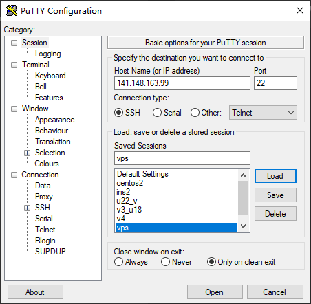
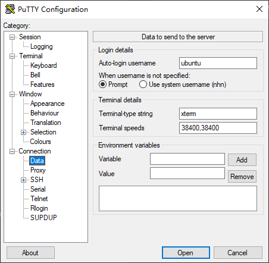
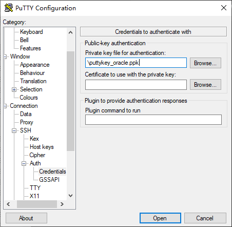
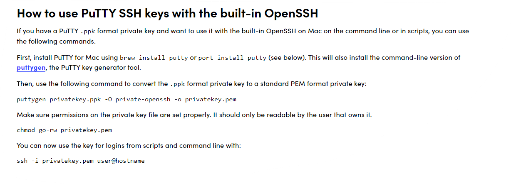

主要记录大体流程和需要注意的地方，方便以后再次操作时可以参考，具体的步骤可以看引用链接。

## Oracle Cloud
### 注册
很多人会卡在信用卡认证上，去年的我也是，需要注意的有：

- 信用卡姓名要填真实姓名，不要写反了，比如叫王二，first name：二，last name：王
- 地址可以随便填，需要唯一，我填的拼音，编的
- 注册时选择的地区，不升级付费账户不可更换，所以想好了再注册
- 不要用同一张卡开通多个账号，不要用同一个人的不同卡开通多个账号，可能会被连带封号
- 注册时会扣1美元左右验证，成功后会立刻被退会，注册成功后不要解绑卡，会不定期进行再次验证，我在一周内就被验证了第二次

### 创建实例
支持免费创建2个VM.Standard.E2.1.Micro实例（AMD），和最多4个Ampere A1实例（ARM），官方提供的Linux，除了Oracle自己的以外免费的有Centos和Ubuntu。
Centos不支持Ampere。可任意更换公网ip，偶尔有的公网ip会被墙，创建完成后先ping一下。

- 不要忘记保存好密钥，之后无法再下载
- 取消勾选使用传输中加密
- 不要忘记修改网络入站规则
- 删除实例时必须勾选永久删除附加的引导卷
- Ampere的实例在试用期结束时可能会被删除

[引用1](https://blog.8owe.com/656.html) 

### 连接实例
#### windows
windows上我用的Putty进行ssh连接，先用Puttygen将私钥转换成ppk格式。再在Putty中做几个配置：

- Session中输入ip，其他默认不需要修改，其余修改结束后可以起个名字点击Save，将配置保存下来方便下次使用  
  
- Connection-Data中输入Auto-login username，ubuntu为ubuntu，centos为opc  
  
- Connection-SSH-Auth-Credentials中在Private key file for authentication下选择转换后的ppk文件  
  

#### mac
mac上我用的系统自带ssh连接，先装一个Putty，再用Puttygen将ppk格式密钥转成pem格式，使用pem密钥进行连接。

[](https://www.ssh.com/academy/ssh/putty/mac)  
也可以使用ssh-add添加key文件，`ssh-add -k key.pem`，以后`ssh root@IP`就可以了。

## V2ray
### 安装
我使用的是一键脚本，比较方便。  
ssh连接以后，需要先切换到root：  
`sudo -i`  
之前在谷歌云上用的这个：  
`bash <(curl -s -L https://git.io/v2ray-setup.sh)`  
但是可能因为V2ray版本升级到了5以上，这个脚本有一些错误，最近安装使用的旧版本：  
`bash <(curl -sL https://git.io/v2ray.sh) online old`  
安装后可以执行：  
- `v2ray url`  
  生成vmess或者vless连接，V2rayNG客户端兼容很好，其他客户端可能需要手动输入信息。
- `v2ray qr`  
  生成连接二维码，方便手机扫码，V2rayNG客户端兼容很好，其他客户端可能需要手动输入信息。
- `v2ray status`  
  查看运行状态，显示这样的为成功
  - `V2Ray 状态: 正在运行`
  - `V2Ray 状态: 正在运行  /  Caddy 状态: 正在运行`
- `v2ray`  
  看文字可执行其他功能  
  
[作者的说明](https://github.com/233boy/v2ray/wiki/V2Ray%E6%90%AD%E5%BB%BA%E8%AF%A6%E7%BB%86%E5%9B%BE%E6%96%87%E6%95%99%E7%A8%8B)

### 防火墙
如果仅在Oracle Cloud控制台中设置了入站规则，即使V2ray状态运行中，客户端也无法正常连接，还需要在服务器上开放端口。
#### Ubuntu
```shell
iptables -P INPUT ACCEPT
iptables -P FORWARD ACCEPT
iptables -P OUTPUT ACCEPT
iptables -F
apt-get purge netfilter-persistent -y
reboot
```
#### Centos
```shell
systemctl stop oracle-cloud-agent
systemctl disable oracle-cloud-agent
systemctl stop oracle-cloud-agent-updater
systemctl disable oracle-cloud-agent-updater
systemctl stop firewalld.service
systemctl disable firewalld.service
reboot
```
[参考](https://www.dzdxtd.com/archives/375)

### 域名伪装
之前的自动脚本用的是mKCP+dtls，不需要伪装域名，我有一台使用了VLESS_WebSocket_TLS，就需要用准备一个域名了。
#### [Freenom](https://freenom.com/)
可以申请顶级免费域名，现在注册有一些验证，而且页面几分钟不操作就会失效。无法注册可以试试个人信息中填写与ip所在地相同的国家。购买域名时默认3个月别忘了选择12个月。    
购买成功后建立一条A记录指向VM的ip，等几分钟，域名能ping通，ip正确的话就可以进行V2ray安装了，这个脚本会验证域名指向是否正确。

[无法注册购买可以试试](https://zhuanlan.zhihu.com/p/109553641)

#### Cloudflare
可以指向CDN，在freenom的DNS中删除旧的加入Cloudflare登录后分配的两个地址，我是等了几个小时Cloudflare才显示成功，然后同上建立A记录指向VM的ip，注意proxy代理需要关闭（即为NDS only）。  
成功安装V2ray后，把代理打开。

[脚本作者的Wiki](https://github.com/233boy/v2ray/wiki/%E4%BD%BF%E7%94%A8Cloudflare%E4%B8%AD%E8%BD%ACV2Ray%E6%B5%81%E9%87%8F)

### 客户端
我用的
- Android V2rayNG
- Windows V2rayN
- Mac V2rayU

最后使用体验，建了删删了建试了几种，目前为止没有被墙的。连接速度不如谷歌云，可能是因为我的地区没选在亚洲。
使用Cloudflare的延迟要高很多，跟国内CF的限制有关吧。
如果对稳定性没有那么高的要求还是不建议配置带伪装域名的，ip可以随时换，不怕墙。
晚上下载速度最高只有3，4m/s，原因不明，凌晨好的多。
之后就看能不能一直薅着羊毛了。
